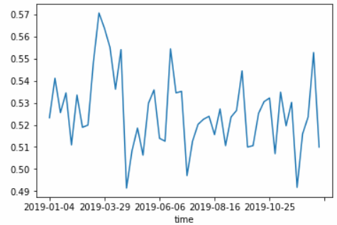
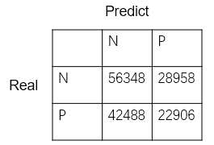

# PHBS_MLF_2019
MLF Team Project

## Team members:
Name                   |     Student ID    |     GitHub ID
-----------------------|-------------------|---------------------------------
Hu Tianrui(胡天锐) | 1901212587 | [PeterHuTHU](https://github.com/PeterHuTHU)
Yu Haiyang(余海洋) | 1901212663 | [Yavin-1018](https://github.com/Yavin-1018)
Zhang Peidong(张培栋) | 1901212671 | [ZhangPeidong-Mack](https://github.com/ZhangPeidong-Mack)
Zhong Lin(钟林) | 1801212992 | [zhong-lin-pku](https://github.com/zhong-lin-pku)

## Project goal
Our goal is to predict trends of stocks based on the historicial data. We will apply classifiers such as SVM, decision tree, logistic regression and random forest to predict the trends of stocks and then compare advantages and disadvantages of each model. What's more, we can try to predict the trends of some specific stocks to test if our model is reliable in reality and to refine our model as well.

## Data Description
We use trading data of Shenzhen Stock Exchange and Shanghai Stock Exchange from 2017-01-01 to 2019-12-31. Features include the opening price, closing price, highest price, lowest price, trading volume and turnover. The dataset is too large so we only upload part of it. Click [here](https://pan.baidu.com/s/1aaYOzaOtSxtKzsZU-PMNlg) with extraction code "nspy" if you want to see a complete version of our data.

## Factor Introduction
We use some quantification factors: 

Factors |                                           Meaning                                                                          |
--------|----------------------------------------------------------------------------------------------------------------------------|
  MACD  | Moving Average Convergence, measures the separation and aggregation of short-term and long-term index moving average
  RSI   |Relative Strength Index, reflect the prosperity of the market in a certain period of time
  EMA   |Exponential Moving Average, a trend index 
  MOM   |Momentum, measures the speed of price changes
  ATR   |Average True Range, represent market change rate

## Data Preprocessing
Raw data collected from JQ-Quant Database needs to be cleaned and features can therefore be derived from processed data. 

Several stocks was delisted during the past 3 years, for those stocks which are not qualified for trading, we removed them from the stock pool. For the remaining stocks, their nan data due to trade suspension are filled using the previously most close available data. In this way, we finally get rid of all the nan values and can proceed to the next session.

Then we import the package 'talib'. Using this package, we calculated several popular technical factors, including MOM stands for Momentum, RSI stands for Relative Strength Index, EMA stands for Exponential Moving Average, MACD stands for Moving Average Convergence / Divergence and ATR stands for Average true range. These factors will be used to build our models to predict trends of stock prices according to their factor loadings.

Finally, we turn the daily frequency data into week frequency data. In the transformation, we view every 5 trading days as a week. Then we classify weeks into odd number weeks and even number weeks. For example, week 1, week 3 belong to the former class and week2, week 4 belong to the latter class. If stock return in one particular even number week, namely week 2t is negative, then we label corresponding Yt to be -1, and vise versa. Factors in week 2t-1 are viewed as Xt, we make pairs of (Xt, Yt) and our goal is to build models to predict Yt based on corresponding Xt.
## Applying SVM model
The purpose of this part is to derive an SVM model to predict trends of stock prices using the factors stated above.

We devide our data set into training set and test set. According to datetime, the former 80% belongs to the training set and the rest belongs to test set. We devide data according to datetime in order to avoid the influence of so called future information.

In order to reduce the time of computing, we use pca method to deduct dimensions. We observed that the 3 most import features can explain almost 90% of all the variance, so we used pca method and set components equal to 3. 
Then we tried to use linear kernel to build our model, but several problems occured. First of all, size of training data is too big(almost 180000 sample points), making the model building process very slow.Secondly, because the market behaved very bad in Year 2018, the label '-1' in training set appears much more often than the label '1', which will lead to the problem of sample imbalance.

To solve the problems stated above, we changed the training set. We randomly select 1000 sample points whose Y is labeled as '1' and 1000 another labeled as '-1', along with X corresponding to those Y we form a new 'training set'. We tested kernels like 'rbf' and 'linear', along with different parameters. We found that when using 'linear' kernel and set C=10.0, the model behaved fairly well. The result of it is listed as follows. We can see that the accuracy is about 57.9% on the test set and the precision and recall rate are all at a acceptable level. Also accuracy of 57.9% seems to be not to high, but if we employ a investing strategy based on this model, because of law of large numbers, we can expect the stratrgy to receive a nice return.

## Decision Tree
For Decision Tree method, data preprocessing is really simple. We don't need to standardize the data, what we need to do is just generate labels. We also use weekly frequency data, and the tag value is determined by the positive and negative excess return of the next week compared to the whole market. The factors we use in Decision Trees are MACD, RSI, EMA, MOM and ATR. And we looking at the results of the model from two prespectives: 
### Method 1
We study the parameters for each stock seperately, and the most simple method is for each stock, we just divide the 145 samples into the training set and the testing set, and we can get the predicting acurracy.
And the average results for all stocks are listed here: 

training accuracy is:  96.86%

testing accuracy is:  52.13%
### Method 2
Logically speaking, we could not forecast the past with future data, so then we do another test, we use the samples in 2017 and 2018 as the training set, and the samples in 2019 as the testing set. And we are now interested in each week's results in 2019. 

The results are listed below. the average testing accuracy is 52.59%, and each week's results are displayed:

We can also see the F1 score and the confusion matrix:

accuracy_score is: 0.5259057730590577

precision_score is:  0.4416550979484806

recall_score is:  0.35027678380279537

f1_score is:  0.3906940251411418

ding
We can find out that more than half of the stocks didn't beat the market, one of the reasons is that we use simple averages instead of market capitalization weighted averages, so the accuracy score and precision score are underestimated. 

If we set one parameter of the function, average as "weighted", which means we calculate metrics for each label, and find their average weighted by support, and can account for label imbalance, we find the results here: 

precision_score is:  0.5143724083513994

recall_score is:  0.5259057730590577

## Applying logistic regression
For the method of logistic regression, we divide the data into training data(80%) and test data(20%）and do some standardization. We get same data processing as we mentioned in SVM and decision tree, and k-fold cross-validation is also applied in model to get a better result. After runing the regression and adujst the parameters accordingly, we find that the model behave better under C=10.0 and 'l2' penalty method.

In logistic regression, we can get the results as followings:
training accuracy  | testing accuracy | precision_score | recall_score | f1_score |
-------------------|------------------|-----------------|--------------|----------|
0.974|0.532|0.960|0.087|0.159
