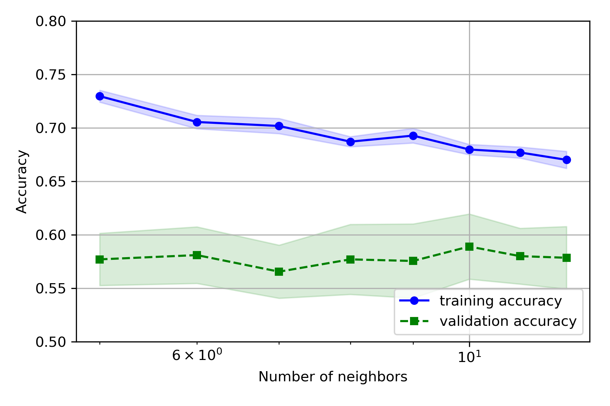

# Predicting trends of stock price based on the data from 2017-2019(Group 9)

## Team members:
Name                   |     Student ID    |     GitHub ID
-----------------------|-------------------|---------------------------------
Hu Tianrui(胡天锐) | 1901212587 | [PeterHuTHU](https://github.com/PeterHuTHU)
Yu Haiyang(余海洋) | 1901212663 | [Yavin-1018](https://github.com/Yavin-1018)
Zhang Peidong(张培栋) | 1901212671 | [ZhangPeidong-Mack](https://github.com/ZhangPeidong-Mack)
Zhong Lin(钟林) | 1801212992 | [zhong-lin-pku](https://github.com/zhong-lin-pku)

## Project goal
Our goal is to predict trends of stocks based on the historical data. We will apply classifiers such as SVM, decision tree, logistic regression and random forest to predict the trends of stocks and then compare advantages and disadvantages of each model. What's more, we can try to predict the trends of some specific stocks to test if our model is reliable in reality and to refine our model as well.

## Data Description
We use trading data obtained from JQ-Quant Database from 2017-01-01 to 2019-12-31. Features include the opening price, closing price, highest price, lowest price, trading volume and turnover. The dataset is too large so we only upload part of it. Click [here](https://pan.baidu.com/s/1aaYOzaOtSxtKzsZU-PMNlg) with extraction code "nspy" if you want to see a complete version of our data.

## Factor Introduction
We use some quantification factors: 

Factors |                                           Meaning                                                                          |
--------|----------------------------------------------------------------------------------------------------------------------------|
  MACD  | Moving Average Convergence, measures the separation and aggregation of short-term and long-term index moving average
  RSI   |Relative Strength Index, reflect the prosperity of the market in a certain period of time
  EMA   |Exponential Moving Average, a trend index 
  MOM   |Momentum, measures the speed of price changes
  ATR   |Average True Range, represent market change rate

## Data Preprocessing
Raw data collected from JQ-Quant Database needs to be cleaned and features can therefore be derived from processed data. 

Several stocks was delisted during the past 3 years, for those stocks which are not qualified for trading, we removed them from the stock pool. For the remaining stocks, their nan data due to trade suspension are filled using the previously most close available data. In this way, we finally get rid of all the nan values and can proceed to the next session.

Then we import the package 'talib'. Using this package, we calculated several popular technical factors, including MOM stands for Momentum, RSI stands for Relative Strength Index, EMA stands for Exponential Moving Average, MACD stands for Moving Average Convergence / Divergence and ATR stands for Average true range. These factors will be used to build our models to predict trends of stock prices according to their factor loadings.

Finally, we turn the daily frequency data into week frequency data. In the transformation, we view every 5 trading days as a week. Then we classify weeks into odd number weeks and even number weeks. For example, week 1, week 3 belong to the former class and week2, week 4 belong to the latter class. If stock return in one particular even number week, namely week 2t is negative, then we label corresponding Yt to be -1, and vise versa. Factors in week 2t-1 are viewed as Xt, we make pairs of (Xt, Yt) and our goal is to build models to predict Yt based on corresponding Xt.
## Applying SVM Model
The purpose of this part is to derive an SVM model to predict trends of stock prices using the factors stated above.

We devide our data set into training set and test set. According to datetime, the former 80% belongs to the training set and the rest belongs to test set. We devide data according to datetime in order to avoid the influence of so called future information.

In order to reduce the time of computing, we use pca method to deduct dimensions. We observed that the 3 most import features can explain almost 90% of all the variance, so we used pca method and set components equal to 3. 
Then we tried to use linear kernel to build our model, but several problems occured. First of all, size of training data is too big(almost 180000 sample points), making the model building process very slow.Secondly, because the market behaved very bad in Year 2018, the label '-1' in training set appears much more often than the label '1', which will lead to the problem of sample imbalance.

To solve the problems stated above, we changed the training set. We randomly select 1000 sample points whose Y is labeled as '1' and 1000 another labeled as '-1', along with X corresponding to those Y we form a new 'training set'. We tested kernels like 'rbf' and 'linear', along with different parameters. We found that when using 'linear' kernel and set C=10.0, the model behaved fairly well. The result of it is listed as follows. We can see that the accuracy is about 57.9% on the test set and the precision and recall rate are all at a acceptable level. Also accuracy of 57.9% seems to be not to high, but if we employ a investing strategy based on this model, because of law of large numbers, we can expect the stratrgy to receive a nice return.

training accuracy  | testing accuracy | precision_score | recall_score | f1_score |
-------------------|------------------|-----------------|--------------|----------|
0.588|0.579|0.58|0.58|0.58

Confusion matrix 
14608   | 7471
--------|--------
10286   | 9831

In addition, we applied GridSearch to determine the best parameters for SVM model. We set parameters range = [0.0001, 0.001, 0.01, 0.1, 1.0, 10.0, 100.0, 1000.0] and kernel to be linear and rbf. The GridSearch found that when using rbf kernel and set C=100.0, gamma = 0.01, the SVM model can reach an accurancy of 0.6025. Furthermore, the result on test set is listed as follows:
training accuracy  | testing accuracy | precision_score | recall_score | f1_score |
-------------------|------------------|-----------------|--------------|----------|
0.6025|0.610|0.61|0.61|0.61

Confusion matrix 

## Applying Decision Tree Model
For Decision Tree method, data preprocessing is really simple. We don't need to standardize the data, what we need to do is just generate labels. We also use weekly frequency data, and the tag value is determined by the positive and negative return of the next week. The factors we use in Decision Trees are MACD, RSI, EMA, MOM and ATR. And we looking at the results of the model from two prespectives: 

### Results
Logically speaking, we could not forecast the future with past data, we use the first 80% of the data as the training set, and the last 20% percent of the data as the testing set.  

The results are listed below. the average testing accuracy is 56.13%

We can also see the F1 score and the confusion matrix:

 testing accuracy | precision_score | recall_score | f1_score |
------------------|-----------------|--------------|----------|
0.56|0.56|0.56|0.55|

Confusion matrix 
15123   | 6956
--------|--------
11555   | 8562

## Applying Logistic Regression Model
For the method of logistic regression, we divide the data into training data(80%) and test data(20%）and do some standardization. We get same data processing as we mentioned in SVM and decision tree, and k-fold cross-validation is also applied in model to get a better result. After runing the regression and adujst the parameters accordingly, we find that the model behave better under C=10.0 and 'l2' penalty method.

In logistic regression, we can get the results as followings:
training accuracy  | testing accuracy | precision_score | recall_score | f1_score |
-------------------|------------------|-----------------|--------------|----------|
0.974|0.532|0.960|0.087|0.159

Confusion matrix 
30956   | 116
--------|--------
29189   | 2773

## Applying KNN Model
In this part we use the KNN method to predict trends of stock prices. Compared to other classifiers, KNN is a relatively simple method because it has less parameters. It is also easy to understand because we only use the concept of ‘distance’. However, its drawback is also very obvious: too much computational cost. So we have to find a good balance between accuracy and computational cost. 

To save computational cost, we use PCA method and set the component equivalent to 3. Just like in the SVM part, we randomly choose 1000 positive and 1000 negative data points as our new training set. We learn from 10 nearest neighbors, and the results show that KNN performs well:

training Accuracy |  testing Accuracy
------------------|----------------
0.689| 0.559

The learning curve show that the gap between validation and training accuracy does not widen when the number of samples becomes larger. From the validation curve we can also see that 10 nearest neighbors is a good choice if we want to save computational cost and alleviate overfitting.

To see the proportion for KNN to mistake an upgoing trend for a downward one, we calculate the confusion matrix. Based on the confusion matrix, we can calculate the precision, recall and F1-score. The recall score is lower than random guess, but this will not cause investors' direct loss because it mistakes an upgoing trend for a downward one and investors do not invest in these stocks.

Confusion matrix 
14532   | 7547
--------|--------
11079   | 9038

precision_score | recall_score | f1_score |
----------------|--------------|----------|
0.545|0.449|0.493

We then use GridSearch to check whether it is worthy of changing the number of neighbors. We set the range of numbers of neighbors to be \[5,20\] and the result shows that 14 gets the best score. The accuracy, precision, recall and F1-score are as follows:

training accuracy  | testing accuracy | precision_score | recall_score | f1_score |
-------------------|------------------|-----------------|--------------|----------|
0.664|0.560|0.546|0.459|0.499

If we learn from 14 neighbors instead of 10 neighbors, both testing accuracy and precision increase by 0.1 pct, which is very small amount. The recall increases by 1 pct, but still lower than random guess. Besides, the computional cost increases by a large amount when we train a larger dataset. Therefore, 10 neighbor is a good choice if we want to have a balance between accuracy and computional cost.

## Improvements in the future
1. We only chose a few of the quantification factors in our research. We believe that as we add more factors in the future, the more predictive power our model will have.

2. We did not consider differences between industries. Different firms in different industries may have quite different factors performance.

3. We did not do well enough in data visualization, which will be definitely improved later.
